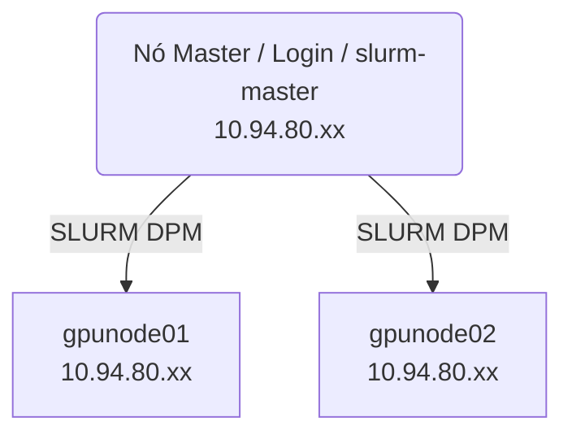

# 📄 Cluster HPC TECHNE — Documentação Técnica

Este repositório documenta a arquitetura, infraestrutura, guias de treinamento e pipeline de monitoramento do **Cluster HPC TECHNE**, centro de pesquisa focado em Inteligência Artificial e Processamento de Alto Desempenho (HPC) do Núcleo de Computação de Alto Desempenho (NCAD) da Universidade Federal do Piauí (UFPI).

---

## 📌 1. Visão Geral e Arquitetura

O cluster TECHNE é gerenciado de forma centralizada pelo agendador **SLURM Workload Manager**, contando com nós dedicados para processamento massivo (CPU e GPU NVIDIA L4), armazenamento compartilhado e monitoramento em tempo real.

### Diagrama da Rede



### 🔧 Componentes Principais

| Componente | Detalhes Técnicos |
|-----------|-------------------|
| **Controlador / Master** | `slurm-master` — IP: `10.94.80.xx`<br>Serviços: Acesso SSH, Slurmctld, Slurmdbd, PostgreSQL/MariaDB, Munge |
| **Nó de Execução 1** | `gpunode01` — IP: `10.94.80.xx`<br>16 Cores, 62.9 GB RAM, 2x GPUs NVIDIA L4 |
| **Nó de Execução 2** | `gpunode02` — IP: `10.94.80.xx`<br>12 Cores, 31.0 GB RAM, 1x GPU NVIDIA L4 |
| **Sistema Operacional** | Linux **Ubuntu 24.04.2 LTS** (Noble) — Kernel 6.8.x |
| **Armazenamento Central**| NFS em `10.94.80.xx:/data/cluster/users` montado em `/data/` **(2.6 TB)** + LVM de 48GB no disco raiz |

### 🖥️ Configuração de Hardware (via `lshw`)

- **CPU:** Intel® Xeon® Gold 6526Y (2 sockets lógicos)  
- **RAM Total:** 32 GiB / 64 GiB (disponibilizados ao Slurm via `RealMemory`)  
- **GPUs:** NVIDIA L4 (AD104GL) Tensor Core — 24 GB VRAM cada  
- **Controladoras:** Virtio SCSI e Virtio Network  

---

## 📡 2. Configuração do Agendador Slurm

O Slurm é configurado de modo centralizado e replicado em todos os nós críticos, utilizando Munge para autenticação de mensagens.

### 🚦 2.1. Partições (Filas de Execução)

O agendador opera em modo `sched/backfill`, com distribuição pautada por recursos consumíveis (`select/cons_tres`).

| Partição  | Tempo Max | Grupos Permitidos                          | Prioridade | Padrão? | Descrição                                  |
| --------- | --------- | ------------------------------------------ | ---------- | ------- | ------------------------------------------ |
| **`debug`** | 30 min    | `Administração / ncad`                     | 🔴 100     | Não     | Testes rápidos e depuração de modelos. Precedência máxima. |
| **`gpu`**   | 2 dias    | `Laboratórios e Grupos de Pesquisa`        | 🟡 50      | **Sim** | Fila principal para treinamentos regulares regulares. |
| **`long`**  | 7 dias    | `Pesquisadores e Docentes`                 | 🟢 10      | Não     | Destinada a execuções assíncronas de longa duração. |

*(Nota: O cluster usa `AccountingStorageEnforce=limits,qos,safe` para limitação rígida de cotas por account).*

### 📊 2.2. Contabilidade e Logs

-   **slurmdbd** executando no controlador (Porta 6819).
-   Track de Processos base em `proctrack/cgroup`.
-   Bancos de Dados:
    -   **MariaDB** → Slurm Accounting
    -   **PostgreSQL** → Métricas do monitoramento customizado
-   Usuário **manager** possui `AdminLevel=Manager` no utilitário `sacctmgr`.

---

## 📈 3. Pipeline de Monitoramento (Customizado)

O cluster possui um avançado pipeline próprio de coleta e visualização de métricas de infraestrutura via Python + PostgreSQL + Grafana.

### 🐍 3.1. Agente de Coleta (Python + Prometheus Exporter)

A infraestrutura roda um exportador nativo via `slurm_exporter.service` complementado pelo nosso agente inteligente customizado:

-   **Pipeline Customizado:** `/opt/cluster_monitor/collect_metrics.py`
-   **Execução:** A cada **1 minuto** (via `cron`)
-   **Funções:**
    -   Coleta completa do estado do cluster (jobs, GPU, CPU, RAM) via comandos do Slurm e `nvidia-smi`
    -   Normalização rigorosa dos dados
    -   Envio em batch ao PostgreSQL

#### ✔️ Correção Importante de Ambiente (CUDA)

Para total compatibilidade das bibliotecas PyTorch e CUDA no script de monitoramento:

``` bash
export LD_LIBRARY_PATH=$LD_LIBRARY_PATH:/lib/x86_64-linux-gnu
```

### 🗄️ 3.2. Estrutura do Banco (PostgreSQL)

| Tabela | Armazena | Uso |
| --- | --- | --- |
| **gpu_log** | Utilização, memória VRAM usada, temperatura | Gráficos temporais de comportamento da GPU |
| **job_log** | Histórico de jobs (JobID, runtime, estados) | Segurança, auditoria e estatísticas de uso |
| **queue_state** | Contagem de jobs em espera/rodando | Painel visual da saturação do cluster |
| **utilization** | Uso bruto de CPU (%) e RAM (%) por nó | Painéis de ocupação e capacity planning |

### 📊 3.3. Dashboards no Grafana

-   **Jobs por Estado** → Gráfico de barras (running vs pending)
-   **Uso da GPU** → Séries temporais dissecadas por placa (GPU 0... GPU n)
-   **Uso de Disco** → Gauge de acompanhamento de percentual livre

---

## 🛠️ 4. Guias de Uso e Treinamento PyTorch

Submissão de jobs baseia-se fortemente nos recuros extras (Gres).

```bash
# Solicita 2 GPUs para um script de treino
#SBATCH --gres=gpu:2
```

### Exemplos Inclusos neste Repositório:

* 📁 **[Treino_Teste](./Treino_Teste/)**: Demonstração completa `end-to-end` contendo todo o fluxo de **Treinamento de Rede Neural PyTorch** via `DistributedDataParallel (DDP)`. Inclui job slurm, scripts parametrizados e infraestrutura inicial para novos usuários.

---

## 🧩 5. Stack de Tecnologias (Active Stack)

| Categoria | Tecnologias |
| --- | --- |
| **Gerenciamento / Workload** | Slurm 23.11.4, Munge, systemd, Cgroups |
| **Aceleração HPC** | NVIDIA Drivers 570.x, CUDA 12.0/12.8, cuDNN 8.9 |
| **Desenvolvimento Base** | Python 3.12, venv |
| **Bibliotecas do Pipeline** | `psycopg2`, `psutil`, `subprocess`, `re`, `python-dotenv` |
| **Dados e Observabilidade** | PostgreSQL, MariaDB, Grafana |
| **Infraestrutura / Rede** | SSH/SCP, ufw, NFS, LVM |

---

## 📚 Licença

Este documento e seus códigos correlatos (como em `/Treino_Teste`) fazem parte da infraestrutura inteiramente aberta do Cluster TECHNE. São encorajados para uso em estudos, clones de arquitetura e setups reproduzíveis.

## ✨ Contato

**INFRA NCAD / UFPI**
Gerenciamento e Desenvolvimento do Cluster HPC TECHNE
